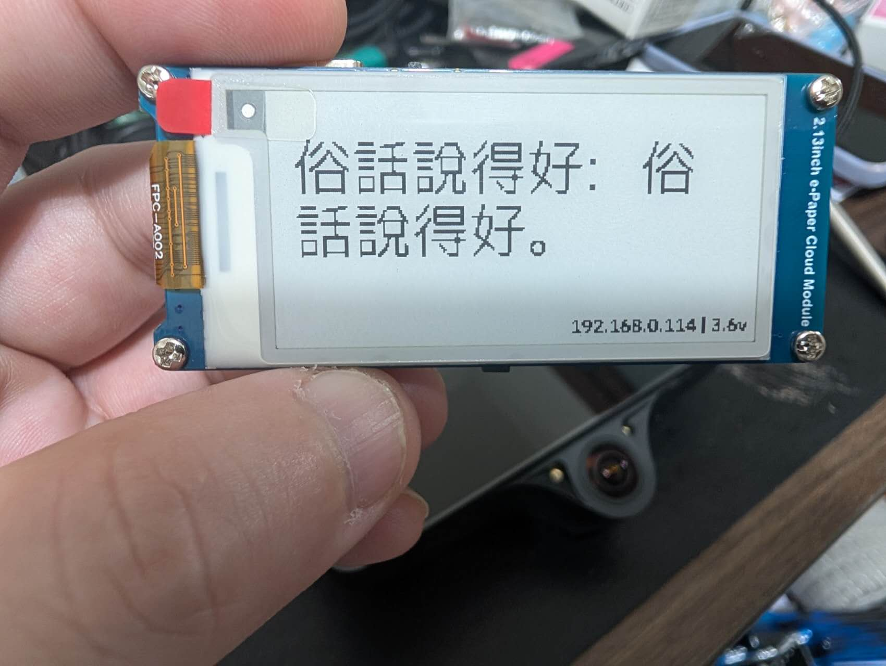

# 每日廢話機 📜💬

> 每天醒來抬頭看一眼，給你一句神級廢話。
> ESP32 + 2.13 吋電子紙 ‧ 離線優先 ‧ 每週用 AI 自動生成新廢話

   



> 實機照：大字繁體中文（OpFont）、USB 朝上、右下角 `IP | 電壓`。

---

## 🤔 這是什麼

一塊停產的 Waveshare 2.13" 電子紙模組，每天顯示一句**繁體中文廢話文學**——
那種「聽君一席話，如聽一席話」「俗話說得好：俗話說得好」式的同義反覆。
螢幕大字置中、超省電、平常完全離線，每週才連一次 WiFi 把新廢話抓下來。

新廢話哪來的？**每週由 GitHub Actions 呼叫 AI 自動生成**（見下方「每週自動更新」）。

---

## ✨ 功能

- 📜 **每日一句** — 每天換一句，部分刷新、瞬間完成
- 🔤 **大字繁體中文** — 30px 置中大字，自訂 UTF-8 點陣渲染（非 Adafruit 內建字型）
- 🌐 **離線優先** — 內建 fallback 句 + LittleFS 快取，沒 WiFi 照樣顯示
- 🔄 **每週同步** — 每 7 天連一次 WiFi，拉 GitHub 上的 `quotes.json`
- 🤖 **AI 自動產廢話** — GitHub Action 每週用 GitHub Models 生成、過濾、去重、commit
- 🔋 **省電** — 平時深度睡眠，靠電池可撐很久
- 📡 **狀態列** — 右下角顯示 `IP | 電壓`

---

## 🧰 硬體

**[Waveshare 2.13inch e-Paper Cloud Module](https://www.waveshare.com/wiki/2.13inch_e-Paper_Cloud_Module)**（已停產）

- ESP32-WROOM-32 + 2.13" 黑白電子紙（250×122，SSD1680 → `GxEPD2_213_BN`）
- 1800mAh 鋰電池 + 充電電路、板載按鈕、CP2102 USB-UART、Type-C

接線**不用自己接**，模組已內建。預設腳位（已寫死在韌體）：

| 功能 | GPIO | 功能 | GPIO |
|------|------|------|------|
| EPD CS | 15 | EPD SCK | 13 |
| EPD DC | 27 | EPD MOSI | 14 |
| EPD RST | 26 | 按鈕 KEY | 12 |
| EPD BUSY | 25 | 電池 ADC | 36 |

> ⚠️ SPI 接在 **SCK=13 / MOSI=14**（非 ESP32 預設腳位），韌體在 `setup()` 內已用
> `SPI.begin(13,-1,14,15)` 重新對應。少了這行螢幕不會有反應。
> 詳見 [`wiring.md`](wiring.md)。

### 🧊 外殼（3D 列印）

社群現成的外殼，直接列印就能裝：

- [Printables：Case for Waveshare 19399 2.13inch e-Paper Cloud Module](https://www.printables.com/model/897515-case-for-waveshare-19399-213inch-e-paper-cloud-mod)
- [Thingiverse：thing 6204051](https://www.thingiverse.com/thing:6204051)

---

## 🚀 燒錄（用 arduino-cli）

```bash
# 1. 安裝 ESP32 開發板支援
arduino-cli config init
arduino-cli config add board_manager.additional_urls \
  https://espressif.github.io/arduino-esp32/package_esp32_index.json
arduino-cli core update-index
arduino-cli core install esp32:esp32

# 2. 安裝函式庫
arduino-cli lib install GxEPD2 "Adafruit GFX Library" ArduinoJson

# 3. 設定 WiFi（複製範例後填入你的 2.4GHz 網路；此檔已 gitignore）
cp daily-feihua/wifi_config.h.example daily-feihua/wifi_config.h
$EDITOR daily-feihua/wifi_config.h

# 4. （選用）把 daily-feihua.ino 裡的 JSON_URL 改成你的 raw GitHub 網址
#    沒設也能跑，只是不會同步、永遠用內建/離線的句子

# 5. 編譯 + 燒錄（務必用 Huge APP partition，字型 + 程式約佔 64% flash）
FQBN=esp32:esp32:esp32:PartitionScheme=huge_app
arduino-cli compile --fqbn $FQBN daily-feihua
arduino-cli upload -p /dev/ttyUSB0 --fqbn $FQBN daily-feihua
```

> 開機前記得把模組上的**電源開關撥到 ON**。
> 進不了燒錄模式時：壓住 **BOOT**、點一下 **RESET/EN**、再放開 BOOT。
> 螢幕是 180° 橫向（`setRotation(3)`），讓 USB 朝上。

> 🔑 **WiFi 帳密**寫在 `daily-feihua/wifi_config.h`：這是一個**獨立檔案、已被 gitignore
> 不進版控**，但它是**編譯期 header**（被 `#include` 進主程式），所以帳密會被編進韌體
> `.bin`，並非執行期動態讀取。換 WiFi 要改這個檔後**重新編譯 + 燒錄**。

---

## 🖥️ 螢幕排版

```
┌────────────────────────────────┐
│                                │
│        聽君一席話，            │   ← 30px 大字、置中、自動斷行
│        如聽一席話。            │
│                                │
│              192.168.0.114 | 3.6v │  ← 10px，靠右
└────────────────────────────────┘
```

排版邏輯都在 `daily-feihua.ino` 的 `drawQuoteBlock()` / `drawFooter()`。

---

## 🔤 字型（重點）

電子紙上的中文不是用 Adafruit GFX 內建字型——那套 `write()` 一次只認一個 byte，
**無法處理多 byte 的 UTF-8 / 繁體中文**。本專案改用：

- `font_zh.h` — 由 `generate_font.py` 產生的「**codepoint 排序 glyph 表 + 1bpp bitmap**」
- 韌體內自寫的 UTF-8 解碼 + 二分搜尋 + `drawPixel` blitter（`zhDraw()` 等）
- 字源是 [**opfonts**](https://github.com/eFiniLan/opfonts) 專案輸出的 `OpFont`（IBM Plex Sans 子集）：
  - 狀態列 10px = OpFont-Bold；主廢句 30px = OpFont-Regular
  - 內含**整份教育部常用國字標準字體表（4,808 字）**，所以未來新生成的廢話用到任何
    常用字都已有 glyph，裝置端不必重產字型
  - OpFont 缺的字（極少數）自動 fallback 到系統 Noto Sans CJK

### 重新產生字型

```bash
# 需要：Python + Pillow，且本機有 opfonts 專案（預設路徑 ~/op/opfonts）與系統 Noto CJK
python3 generate_font.py        # 直接寫進 daily-feihua/font_zh.h
```

> `generate_font.py` 頂端的 `OPFONTS` 路徑目前寫死，換機器請自行調整。

---

## 🤖 每週自動更新（AI 產廢話）

整個迴圈跑在 **GitHub Actions**，裝置只負責每週把結果抓下來：

```
每週日 08:00（台北）GitHub 上：
  generate_feihua.py  → GitHub Models（GPT-4.1，免費、用內建 GITHUB_TOKEN）
  quality_filter.py   → 長度過濾 + 正規化去重（連只差標點的近似句也擋）
  git commit quotes.json（有新句才 commit）
        ↓ raw.githubusercontent.com
  ESP32 每週醒來 → WiFi 同步 → 抓新 quotes.json → 顯示
```

**啟用步驟（一次性）：**

1. 把本 repo 推上 GitHub。
2. `weekly-update.yml` 已放在 `.github/workflows/`，會自動排程；workflow 已宣告
   `permissions: models: read`，呼叫 GitHub Models **不需要任何額外金鑰**。
3. 把韌體的 `JSON_URL` 設成 `https://raw.githubusercontent.com/eFiniLan/daily-feihua/main/quotes.json`，燒一次。
4. 想立刻試：repo 的 **Actions → 每週 AI 生成廢話 → Run workflow**。

**換模型 / 換供應商**：`generate_feihua.py` 走 OpenAI 相容介面，設環境變數即可切換
（`LLM_BASE_URL` / `LLM_MODEL` / `LLM_API_KEY`），例如改用 Google Gemini 免費層。

---

## 🗂️ 資料格式

`quotes.json` 是精簡過的純字串陣列：

```json
{
  "version": "2026-06-16",
  "quotes": ["聽君一席話，如聽一席話。", "吃麵不吃蒜，等於沒吃蒜。", "..."]
}
```

裝置每次喚醒用硬體亂數（`esp_random`）隨機挑一句，斷電重開也不會從頭來。
手動加句子：直接編輯 `quotes.json` 的陣列即可（用到罕見字就重跑 `generate_font.py`）。

---

## 📁 專案結構

```
daily-feihua/
├── daily-feihua/              # Arduino sketch（編譯目標）
│   ├── daily-feihua.ino       #   主程式
│   ├── font_zh.h              #   產生的中文點陣字型（~4MB，已 commit）
│   └── wifi_config.h.example  #   WiFi 設定範本（實際的 wifi_config.h 被 gitignore）
├── generate_feihua.py         # 用 LLM 生成廢話候選（GitHub Models）
├── quality_filter.py          # 過濾 + 正規化去重 + 併入 quotes.json
├── generate_font.py           # 由 opfonts/Noto 產生 font_zh.h
├── feihua_crawler.py          # 舊的 RSS 爬蟲（已被 AI 生成取代，保留備用）
├── quotes.json                # 廢話資料（字串陣列）
├── epd_diag/                  # 顯示診斷 sketch（純 ASCII 測試圖樣）
├── wifi_test/                 # WiFi 連線診斷 sketch
├── wiring.md                  # 接線說明
└── .github/workflows/
    └── weekly-update.yml      # 每週自動產廢話
```

---

## 🩺 診斷工具

開發時很好用，遇到問題先燒這兩個確認硬體：

- **`epd_diag/`** — 不碰字型/JSON/WiFi，只畫邊框 + 對角線 + ASCII，確認面板與旋轉正常。
- **`wifi_test/`** — 掃描 SSID、連線、NTP 對時、HTTPS 抓取，逐步印出哪一關過/沒過。

```bash
arduino-cli compile --fqbn $FQBN epd_diag && arduino-cli upload -p /dev/ttyUSB0 --fqbn $FQBN epd_diag
```

---

## 🐛 常見問題

**Q: 螢幕全白沒反應？**
A: 多半是 SPI 沒對應到 13/14，或面板型號不同。先燒 `epd_diag` 測。若你的是三色版，
把 `display` 改用 `GxEPD2_213_B73` 之類的類別。

**Q: 中文變亂碼或空白？**
A: 確認 `font_zh.h` 有編進去；若是新加的罕見字沒顯示，重跑 `generate_font.py`。

**Q: WiFi 連不上？**
A: 只支援 **2.4GHz**；先用 `wifi_test` 看是掃不到 SSID、密碼錯、還是對外不通。

**Q: 按鈕能換下一句嗎？**
A: 可以。**KEY（GPIO12）短按 = 換一句**（每次喚醒都用 `esp_random` 隨機挑），
**長按 ≥2 秒 = 立刻連 WiFi 同步**最新內容。旁邊的 **EN 是硬體重置**（重開機）。

---

## 📜 廢話金句（最近的最愛）

1. 聽君一席話，如聽一席話。
2. 俗話說得好：俗話說得好。
3. 但凡這句話有一點意義，也不至於一點意義都沒有。
4. 今天是你人生中最年輕的一天，也是今天。
5. 看完這 100 句的人，已經看完這 100 句了。

---

## 📄 License

MIT — 隨便用。字型來源（IBM Plex / Noto）採 SIL Open Font License 1.1。

## 🙏 致謝

- 廢話文學原作者：全體中文網民
- 字型：[opfonts](https://github.com/eFiniLan/opfonts)（IBM Plex Sans 子集）+ Noto Sans CJK 後備
- 硬體：Waveshare 2.13" e-Paper Cloud Module
- 每週新廢話：GitHub Models
